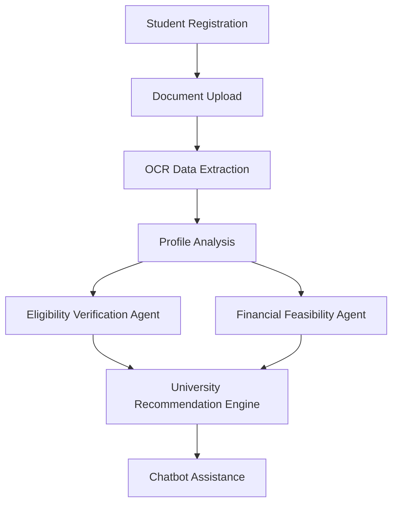

# Multiagent International Study Advisor

This repository contains a multi-agent system designed to help international students from Sri Lanka (and beyond) navigate higher-education applications by matching eligibility, finances, and preferences with university options.

## Core Agents / Components

- **Financial Feasibility Agent** (`multiagent/core/agents/financial_feasibility_agent.py`)
  - Calculates tuition & living costs, adjusts for exchange rates, matches budgets against university costs, and suggests scholarships/alternatives.

- **Eligibility Verification Agent** (`multiagent/core/agents/eligibility_verification_agent.py`)
  - Maps Sri Lankan academic qualifications (A/Ls, GPA) to international entry requirements and identifies pathways.

- **Document Processing (OCR) Agent** (`multiagent/core/agents/document_processing_agent.py`)
  - Extracts grades, transcripts, and other credentials from uploaded documents.

- **Chatbot (UI Agent)** (`multiagent/app.jsx`)
  - Provides conversational guidance, explains requirements, answers "why" questions, and supports users through the application pipeline.

- **Chatbot Agent** (`multiagent/core/agents/chatbot_agent.py`)
  - Handles conversational queries, orchestrates other agents for personalized responses, and provides guidance on eligibility, finances, recommendations, and emotional support.

- **Recommendation Agent** (`multiagent/core/agents/recommendation_agent.py`)
  - Ranks and prioritises universities based on eligibility, financial feasibility, deadlines, and risk.
  - Powered by the eligibility processor (`multiagent/core/processors/eligiblity_calculator.py`) and data from the database phases (`multiagent/core/database/*`).

---

## External Factors → Agent Mapping

This section maps key external factors that impact student decision-making to the agents/components that address them.

### 1. Financial Constraints
**Handled by:** Financial Feasibility Agent + Recommendation Agent

**How it works:**
- Calculates tuition, living costs, and exchange-rate impact.
- Matches student budget with university cost profiles.
- Suggests scholarships and lower-cost alternatives.

**External factors covered:**
- High tuition & living expenses
- Exchange rate fluctuation
- Limited loans/scholarships
- Family income instability

**Outcome for students:**
Avoids unsuitable universities and reduces financial risk.

---

### 2. Access to Reliable Information
**Handled by:** Chatbot Agent + Recommendation Agent

**How it works:**
- Chatbot provides verified, up-to-date answers to common questions.
- Recommendation Agent uses validated datasets and scraped university data only.
- Explains eligibility, fees, deadlines clearly.

**External factors covered:**
- Fragmented information
- Conflicting consultant advice
- Lack of transparency

**Outcome for students:**
Fewer incorrect applications and better-informed decisions.

---

### 3. Educational Background Differences
**Handled by:** Eligibility Verification Agent + OCR Document Agent

**How it works:**
- OCR extracts A/L, diploma, and GPA data from uploaded documents.
- Eligibility agent maps Sri Lankan qualifications to international requirements.
- Identifies pathway or foundation options where required.

**External factors covered:**
- Curriculum mismatch
- Recognition issues
- Credit transfer confusion

**Outcome for students:**
Clear eligibility understanding and reduced blind applications.

---

### 4. Language Proficiency Challenges
**Handled by:** Eligibility Verification Agent + Chatbot Agent

**How it works:**
- Eligibility agent checks IELTS/TOEFL and other language requirements.
- Chatbot provides preparation guidance, tips, and confidence support.

**External factors covered:**
- IELTS/TOEFL requirements
- Low English confidence
- Limited preparation access

**Outcome for students:**
Improved confidence and better admission readiness.

---

### 5. Geographic & Socio-Economic Factors
**Handled by:** Chatbot Agent + OCR Document Agent

**How it works:**
- Chatbot replaces physical consultancy visits with remote guidance.
- OCR allows remote document upload from rural areas.
- Prioritizes mobile-friendly access.

**External factors covered:**
- Rural access limitations
- Travel costs
- Digital divide

**Outcome for students:**
Equal access for all students.

---

### 6. Psychological & Emotional Factors
**Handled by:** Chatbot Agent

**How it works:**
- Provides step-by-step guidance.
- Reduces fear through clear explanations.
- Offers reassurance during decision-making.

**External factors covered:**
- Stress
- Fear of rejection
- Family pressure

**Outcome for students:**
Lower dropout rate and better decision quality.

---

### 7. Visa & Immigration Uncertainty
**Handled by:** Chatbot Agent + Recommendation Agent

**How it works:**
- Chatbot explains visa steps and required documents.
- Recommendation Agent avoids high-risk countries/universities based on policies.

**External factors covered:**
- Visa rejection risk
- Policy changes
- Documentation confusion

**Outcome for students:**
Reduced hesitation and more informed commitment.

---

### 8. Time Constraints & Deadlines
**Handled by:** Recommendation Agent + Chatbot Agent

**How it works:**
- Recommendation Agent prioritizes universities by application deadlines.
- Chatbot sends reminders and explains timelines.

**External factors covered:**
- Multiple deadlines
- Overlapping exams/work
- Manual delays

**Outcome for students:**
On-time submissions and higher acceptance chances.

---

### 9. Trust & Transparency Issues
**Handled by:** Recommendation Agent + Chatbot Agent

**How it works:**
- Recommendation Agent explains why a university is suggested (eligibility fit, cost, deadlines).
- Chatbot answers "why" questions clearly and without commercial bias.

**External factors covered:**
- Consultant bias
- Lack of explanation
- Fear of being misled

**Outcome for students:**
Higher trust and more confident decisions.

---

### 10. Global External Factors
**Handled by:** Recommendation Agent + Chatbot Agent

**How it works:**
- Recommendation Agent suggests online/hybrid options when appropriate.
- Chatbot explains risks and alternatives for pandemics, travel restrictions, political instability.

**External factors covered:**
- Pandemics
- Travel restrictions
- Political instability

**Outcome for students:**
Flexible planning and reduced uncertainty.

---

## 1.7 Conceptual Framework

### 1.7.1 Multi-Agent AI System Architecture

The conceptual framework of the proposed system is based on a multi-agent AI architecture in which specialized agents collaborate to support international study decision-making. The Eligibility Verification Agent evaluates academic and language qualifications, the Document Processing Agent extracts structured information from uploaded records, the Financial Feasibility Agent analyses tuition and living costs against the student's budget, and the Recommendation Agent ranks suitable universities using eligibility, affordability, deadlines, and risk indicators. The Chatbot Agent acts as the interaction layer, coordinating these services and presenting the results in a conversational format.

### 1.7.2 Document Processing and OCR Layer

The document processing and OCR layer is responsible for converting academic transcripts, certificates, language test reports, passports, and financial documents into structured data. In this system, the OCR pipeline uses image preprocessing and OCR extraction to identify key fields such as grades, GPA, English proficiency scores, identity details, and financial records. This layer reduces manual data entry, improves consistency, and provides validated inputs for downstream eligibility and recommendation analysis.

### 1.7.3 University Recommendation Engine

The university recommendation engine analyses the student profile together with eligibility outcomes and financial feasibility results to identify suitable universities. It generates ranked recommendations by considering academic fit, language requirements, affordability, application deadlines, and country-level risk factors. The engine is designed to provide transparent reasoning so that students can understand why a university is recommended, treated as a backup option, or avoided.

### 1.7.4 Budget and Scholarship Matching Module

The budget and scholarship matching module evaluates tuition fees, estimated living costs, exchange-rate effects, and available scholarship opportunities against the student's available budget. Based on this assessment, the module classifies universities as feasible, borderline, or infeasible and highlights relevant scholarships or lower-cost alternatives. This allows the system to align recommendations with realistic financial capacity rather than academic suitability alone.

### 1.7.5 System Workflow Diagram

The workflow of the system follows a sequential but collaborative process. A student first registers and creates a profile, then uploads relevant documents. The OCR and document-processing layer extracts structured data from those files, after which the system performs profile analysis using eligibility and financial modules. The recommendation engine then identifies suitable universities, and the chatbot provides guidance, clarifications, and next-step support.

