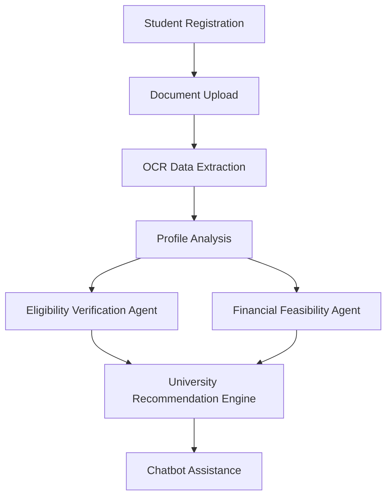

# Multiagent International Study Advisor

This repository contains a multi-agent system designed to help international students from Sri Lanka (and beyond) navigate higher-education applications by matching eligibility, finances, and preferences with university options.

## Core Agents / Components

- **Financial Feasibility Agent** (`multiagent/core/agents/financial_feasibility_agent.py`)
  - Calculates tuition & living costs, adjusts for exchange rates, matches budgets against university costs, and suggests scholarships/alternatives.

- **Eligibility Verification Agent** (`multiagent/core/agents/eligibility_verification_agent.py`)
  - Maps Sri Lankan academic qualifications (A/Ls, GPA) to international entry requirements and identifies pathways.

- **Document Processing (OCR) Agent** (`multiagent/core/agents/document_processing_agent.py`)
  - Extracts grades, transcripts, and other credentials from uploaded documents.

- **Chatbot (UI Agent)** (`multiagent/app.jsx`)
  - Provides conversational guidance, explains requirements, answers "why" questions, and supports users through the application pipeline.

- **Chatbot Agent** (`multiagent/core/agents/chatbot_agent.py`)
  - Handles conversational queries, orchestrates other agents for personalized responses, and acts as the integration layer that explains eligibility, finances, recommendations, documents, deadlines, visa issues, and emotional support in one conversation.

- **Recommendation Agent** (`multiagent/core/agents/recommendation_agent.py`)
  - Ranks and prioritises universities based on eligibility, financial feasibility, deadlines, and risk.
  - Powered by the eligibility processor (`multiagent/core/processors/eligiblity_calculator.py`) and data from the database phases (`multiagent/core/database/*`).


## External Factors → Agent Mapping

This section maps key external factors that impact student decision-making to the agents/components that address them.

The Chatbot Agent is the cross-cutting integration layer for all factors below. It does not replace the specialised agents that perform eligibility, financial, OCR, or recommendation analysis. Instead, it combines their outputs, adds user context and conversation history, and explains the final result to the student in a clear way.

### 1. Financial Constraints
**Handled by:** Financial Feasibility Agent + Recommendation Agent + Chatbot Agent

**How it works:**
- Calculates tuition, living costs, and exchange-rate impact.
- Matches student budget with university cost profiles.
- Suggests scholarships and lower-cost alternatives.
- Chatbot explains the financial result, answers follow-up questions, and can present Gemini-backed grounded guidance when enabled.

**External factors covered:**
- High tuition & living expenses
- Exchange rate fluctuation
- Limited loans/scholarships
- Family income instability

**Outcome for students:**
Avoids unsuitable universities and reduces financial risk.


### 2. Access to Reliable Information
**Handled by:** Chatbot Agent + Recommendation Agent

**How it works:**
- Chatbot provides verified, up-to-date answers to common questions.
- Recommendation Agent uses validated datasets and scraped university data only.
- Explains eligibility, fees, deadlines clearly.
- Chatbot integrates recommendation output with RAG-grounded answers so students receive one consistent explanation.

**External factors covered:**
- Fragmented information
- Conflicting consultant advice
- Lack of transparency

**Outcome for students:**
Fewer incorrect applications and better-informed decisions.

---

### 3. Educational Background Differences
**Handled by:** Eligibility Verification Agent + OCR Document Agent + Chatbot Agent

**How it works:**
- OCR extracts A/L, diploma, and GPA data from uploaded documents.
- Eligibility agent maps Sri Lankan qualifications to international requirements.
- Identifies pathway or foundation options where required.
- Chatbot explains whether the student is directly eligible, borderline, or should consider pathway options.

**External factors covered:**
- Curriculum mismatch
- Recognition issues
- Credit transfer confusion

**Outcome for students:**
Clear eligibility understanding and reduced blind applications.

---

### 4. Language Proficiency Challenges
**Handled by:** Eligibility Verification Agent + Chatbot Agent

**How it works:**
- Eligibility agent checks IELTS/TOEFL and other language requirements.
- Chatbot provides preparation guidance, tips, and confidence support.
- Chatbot converts language-score checks into practical next steps for the student.

**External factors covered:**
- IELTS/TOEFL requirements
- Low English confidence
- Limited preparation access

**Outcome for students:**
Improved confidence and better admission readiness.

---

### 5. Geographic & Socio-Economic Factors
**Handled by:** Chatbot Agent + OCR Document Agent

**How it works:**
- Chatbot replaces physical consultancy visits with remote guidance.
- OCR allows remote document upload from rural areas.
- Prioritizes mobile-friendly access.
- Chatbot keeps the full process accessible through one conversation-driven interface.

**External factors covered:**
- Rural access limitations
- Travel costs
- Digital divide

**Outcome for students:**
Equal access for all students.

---

### 6. Psychological & Emotional Factors
**Handled by:** Chatbot Agent

**How it works:**
- Provides step-by-step guidance.
- Reduces fear through clear explanations.
- Offers reassurance during decision-making.
- Chatbot uses the analysed outputs from other agents to give specific reassurance rather than generic advice.

**External factors covered:**
- Stress
- Fear of rejection
- Family pressure

**Outcome for students:**
Lower dropout rate and better decision quality.

---

### 7. Visa & Immigration Uncertainty
**Handled by:** Chatbot Agent + Recommendation Agent

**How it works:**
- Chatbot explains visa steps and required documents.
- Recommendation Agent avoids high-risk countries/universities based on policies.
- Chatbot connects university recommendations with visa-related follow-up guidance.

**External factors covered:**
- Visa rejection risk
- Policy changes
- Documentation confusion

**Outcome for students:**
Reduced hesitation and more informed commitment.

---

### 8. Time Constraints & Deadlines
**Handled by:** Recommendation Agent + Chatbot Agent

**How it works:**
- Recommendation Agent prioritizes universities by application deadlines.
- Chatbot sends reminders and explains timelines.
- Chatbot turns ranking and deadline data into actionable sequencing for the student.

**External factors covered:**
- Multiple deadlines
- Overlapping exams/work
- Manual delays

**Outcome for students:**
On-time submissions and higher acceptance chances.

---

### 9. Trust & Transparency Issues
**Handled by:** Recommendation Agent + Chatbot Agent

**How it works:**
- Recommendation Agent explains why a university is suggested (eligibility fit, cost, deadlines).
- Chatbot answers "why" questions clearly and without commercial bias.
- Chatbot exposes the reasoning from the underlying agents in plain language.

**External factors covered:**
- Consultant bias
- Lack of explanation
- Fear of being misled

**Outcome for students:**
Higher trust and more confident decisions.

---

### 10. Global External Factors
**Handled by:** Recommendation Agent + Chatbot Agent

**How it works:**
- Recommendation Agent suggests online/hybrid options when appropriate.
- Chatbot explains risks and alternatives for pandemics, travel restrictions, political instability.
- Chatbot integrates these external-risk considerations with the student's current plan and preferences.

**External factors covered:**
- Pandemics
- Travel restrictions
- Political instability

**Outcome for students:**
Flexible planning and reduced uncertainty.

---

## 1.7 Conceptual Framework

### 1.7.1 Multi-Agent AI System Architecture

The conceptual framework of the proposed system is based on a multi-agent AI architecture in which specialized agents collaborate to support international study decision-making. The Eligibility Verification Agent evaluates academic and language qualifications, the Document Processing Agent extracts structured information from uploaded records, the Financial Feasibility Agent analyses tuition and living costs against the student's budget, and the Recommendation Agent ranks suitable universities using eligibility, affordability, deadlines, and risk indicators. The Chatbot Agent acts as the interaction layer, coordinating these services and presenting the results in a conversational format.

### 1.7.2 Document Processing and OCR Layer

The document processing and OCR layer is responsible for converting academic transcripts, certificates, language test reports, passports, and financial documents into structured data. In this system, the OCR pipeline uses image preprocessing and OCR extraction to identify key fields such as grades, GPA, English proficiency scores, identity details, and financial records. This layer reduces manual data entry, improves consistency, and provides validated inputs for downstream eligibility and recommendation analysis.

### 1.7.3 University Recommendation Engine

The university recommendation engine analyses the student profile together with eligibility outcomes and financial feasibility results to identify suitable universities. It generates ranked recommendations by considering academic fit, language requirements, affordability, application deadlines, and country-level risk factors. The engine is designed to provide transparent reasoning so that students can understand why a university is recommended, treated as a backup option, or avoided.

### 1.7.4 Budget and Scholarship Matching Module

The budget and scholarship matching module evaluates tuition fees, estimated living costs, exchange-rate effects, and available scholarship opportunities against the student's available budget. Based on this assessment, the module classifies universities as feasible, borderline, or infeasible and highlights relevant scholarships or lower-cost alternatives. This allows the system to align recommendations with realistic financial capacity rather than academic suitability alone.

### 1.7.5 System Workflow Diagram

The workflow of the system follows a sequential but collaborative process. A student first registers and creates a profile, then uploads relevant documents. The OCR and document-processing layer extracts structured data from those files, after which the system performs profile analysis using eligibility and financial modules. The recommendation engine then identifies suitable universities, and the chatbot provides guidance, clarifications, and next-step support.



## Running After Code Updates

Colab sync rule:

- Colab only sees code that is pushed to GitHub or uploaded into the Colab runtime.
- If you change files in VS Code, commit and push those changes first, then rerun the clone or one-click cell in [colab_clone_guide.ipynb](D:/Multiagent/colab_clone_guide.ipynb).
- The notebook installs backend dependencies from `multiagent/requirement.txt` and frontend dependencies from `multiagent/package.json`, so keep those files aligned with your code changes.

## Runtime Profiles

The application now supports lightweight runtime tuning without removing existing features. Set the `RUNTIME_PROFILE` environment variable before starting the backend.

- `FULL`: higher OCR image cap and larger RAG retrieval settings for stronger hardware.
- `LITE`: lower OCR image cap and smaller RAG retrieval settings for low-performance, low-storage laptops.
- `RESEARCH`: same lightweight defaults as `LITE`, intended for repeatable MSc experiments and metric collection.

PowerShell example:

```powershell
$env:RUNTIME_PROFILE = "LITE"
```

## Neon PostgreSQL Integration

Application-level persistence (auth users, chat history, and user state) supports Neon PostgreSQL.

Tables are auto-created on backend startup when a DB URL is configured:

- users
- sessions
- chat_history
- user_state
- document_uploads

Supported env vars (either one):

- DATABASE_URL
- NEON_DATABASE_URL

Notes:

- If both are set, DATABASE_URL is used.
- sslmode=require is automatically enforced for PostgreSQL URLs.
- `DB_STRICT_MODE` defaults to `true` and `false` is no longer supported.
- The backend will not start without a PostgreSQL/Neon connection string.

PowerShell quick start:

```powershell
$env:NEON_DATABASE_URL = "postgresql://<user>:<password>@<host>/<db>?channel_binding=require"
uvicorn multiagent.api_server:app --host 127.0.0.1 --port 8000 --reload
```

### Student Account Flow (Neon)

The system is now student-only for login and dashboard access.

Current behavior:

1. UI registration always creates a `student` account.
2. Login only uses student flow (admin/advisor role login and dashboards were removed).
3. Demo seeding creates student account only.

Recommended development seed command:

```powershell
python scripts/dev_seed_users.py
```

Default seeded account:

- student: `student@example.com` / `Student@123`

### Real-Time Accuracy Check (Live API)

Run the automated external-factor regression checker against the running backend:

```powershell
python scripts/run_realtime_accuracy_check.py --email student@example.com --password Student@123
```

Quick release check (5 critical cases):

```powershell
python scripts/run_realtime_accuracy_check.py --email student@example.com --password Student@123 --quick
```

What it validates per case:

- detected `intent`
- `agent_data.external_factors` contains expected IDs
- returned `actions` includes expected action hints
- response text contains expected meaning keywords

Reports are written to `reports/realtime_accuracy_*.json` and `reports/realtime_accuracy_*.md`.

Notes:

- User/session data is persisted in Neon/PostgreSQL tables (`users`, `sessions`).
- Legacy admin/advisor role APIs and dashboards are removed from active runtime.

Verify backend DB mode:

1. Open /health endpoint.
2. Confirm db is postgresql, db_url_set is true, and db_strict_mode is true.

### Move Existing JSON Data to Neon Before Startup

Use the migration script before starting the API if you already have legacy local JSON data:

```powershell
$env:DATABASE_URL = "postgresql://<user>:<password>@<host>/<db>?sslmode=require"
python scripts/migrate_json_to_db.py --cleanup-json
```

What it migrates:

- users/users.json -> users
- chat_history/*.json -> chat_history
- user_state/*.json -> user_state

The script creates a backup snapshot in `multiagent/data/backups` before cleanup.

## Logged-In User Data Storage (Current Flow)

When a user logs in, the app now persists all key data per user account:

- Personal + education + financial profile state
  - Saved via `/user/state`
  - Frontend stores `{step, profile, docData, elig}` continuously while progressing through the wizard
  - Also upserted into `user_profile` for SQL-friendly querying/reporting

- Chat messages and agent metadata
  - Saved via `/chat/history`
  - `/chat/history` now requires Bearer auth and only allows access to the current logged-in user
  - Chatbot replies are served by `/chat/respond` (backend chatbot agent)

- Uploaded files (images and PDFs)
  - OCR uploads (`/ocr`) now auto-store files when Authorization token is present
  - Manual file-only upload also available via `/documents/upload`
  - List files: `/documents`
  - Open/Download file: `/documents/{document_id}/content`
  - Delete a file: `/documents/{document_id}`

Storage behavior:

- Metadata and uploaded document binaries are stored in PostgreSQL tables (including `document_uploads`)
- If PostgreSQL/Neon is not configured or reachable, the backend fails fast at startup.

How to use with current frontend:

1. Start backend with `NEON_DATABASE_URL` (or `DATABASE_URL`).
2. Register and log in from the app.
3. Fill profile (personal/education/financial) and upload docs.
4. Data is persisted automatically for that user.
5. In the Documents step, use the "My Stored Documents" panel to refresh, open, and delete saved files.

Document storage hardening:

- Uploaded document binaries are served from PostgreSQL-backed blob storage, not from local runtime disk.
- On startup, the API attempts a one-time import of any legacy on-disk document files still referenced by `document_uploads` rows.

## Current API Notes (April 2026)

- Frontend uses `/chat/respond` for live chatbot responses.
- Frontend and backend both use token-authenticated `/chat/history` for chat persistence.
- `/ocr` accepts optional Bearer auth. If token is present, uploaded file metadata is saved for that user.
- `/health` now returns DB mode fields: `db`, `db_url_set`, and `db_strict_mode` in addition to OCR status.
- PostgreSQL/Neon is mandatory for runtime persistence; JSON fallback has been removed from the API server.

Optional overrides:

```powershell
$env:OCR_MAX_IMAGE_DIM = "720"
$env:RAG_TOP_K = "2"
$env:RAG_CHUNK_SIZE = "500"
$env:RAG_CHUNK_OVERLAP = "100"
```

Recommended low-spec MSc demo profile:

- Use `RUNTIME_PROFILE=LITE`
- Keep OCR at `720` or lower
- Keep retrieval at `RAG_TOP_K=2`
- Index only the curated university database for routine demos
- Run scraping, PDF indexing, and other heavy background tasks only when needed

## Keyless Model Mode (No API Key Required)

The RAG layer now supports a no-key default mode so the backend can run without paid model keys.

- Default behavior: `RAG_LLM_PROVIDER=none`
- Outcome: retrieval-grounded responses from local indexed data (no Gemini/OpenAI key required)
- Optional: set `RAG_LLM_PROVIDER=gemini` and `GOOGLE_API_KEY` only if you want generated narrative responses

PowerShell example (keyless):

```powershell
$env:RAG_LLM_PROVIDER = "none"
```

PowerShell example (optional Gemini):

```powershell
$env:RAG_LLM_PROVIDER = "gemini"
$env:GOOGLE_API_KEY = "your_key_here"
```

Important practical note:

- No model key is required in keyless mode.
- Colab and Cloudflare tunnel sessions are still temporary and may reset.
- So usage is effectively cost-free for model keys, but not truly unlimited runtime.

## Selected MSc Stack (No Ollama)

Use this stack for your thesis implementation and low-performance laptop constraints:

- OCR: Tesseract
- Document classifier: TF-IDF + LinearSVC
- Eligibility model: HistGradientBoostingClassifier
- Financial model: Rule-based + regression/classifier
- Recommendation: Weighted scoring + small ML reranker
- Embeddings: all-MiniLM-L6-v2
- Vector DB: Chroma
- Generator: Keyless grounded responses (default), with optional Gemini only when needed

Implementation note:

- Ollama is not required for this architecture.
- Keep `RAG_LLM_PROVIDER=none` for default no-key operation.

### If you changed frontend code locally

The frontend runs locally with Vite, so changes in [multiagent/app.jsx](multiagent/app.jsx) and other frontend files usually reload automatically.

1. Keep the frontend terminal running:
   `cd d:\Multiagent\multiagent`
   `npm run dev`
2. Open `http://127.0.0.1:5173`
3. Refresh the browser if needed.

### If you changed backend code locally and want to keep using Colab

Colab does not automatically see code changes from your laptop. You must make the updated code available to Colab first.

Option 1: Push your updated code to GitHub, then in Colab rerun these steps:

1. Commit and push the latest VS Code changes to GitHub.
2. Open [colab_clone_guide.ipynb](D:/Multiagent/colab_clone_guide.ipynb).
3. Rerun the backend one-click cell, or rerun the full-stack one-click cell if you also want the frontend on Colab.
4. Copy the new printed `https://...trycloudflare.com` URL.

Frontend with Colab backend (recommended setup):

1. Run backend in Colab and copy the printed `https://...trycloudflare.com` URL.
2. From repo root on your laptop run:
  `powershell -ExecutionPolicy Bypass -File .\set-colab-url.ps1 -Url https://your-url.trycloudflare.com`
3. Start frontend locally:
  `cd d:\Multiagent\multiagent`
  `npm run dev`
4. Open `http://127.0.0.1:5173`

Option 2: Run the backend locally instead of Colab:

1. `cd d:\Multiagent`
2. `.\.venv\Scripts\Activate.ps1`
3. `uvicorn multiagent.api_server:app --host 127.0.0.1 --port 8000 --reload`

Then set [multiagent/.env](multiagent/.env) to:

`VITE_API_URL=http://127.0.0.1:8000`

### If Colab restarts and gives you a new tunnel URL

Update [multiagent/.env](multiagent/.env) with the new URL, or use this helper from the repo root:

`powershell -ExecutionPolicy Bypass -File .\set-colab-url.ps1 -Url https://your-new-url.trycloudflare.com`

Vite will restart automatically after the `.env` file changes.

## Run Frontend + Backend Fully on Colab

If you want both services running on Colab (not local frontend), use the notebook section:

- Open `colab_clone_guide.ipynb`
- Run the new section titled **Full Stack in Colab (Backend + Frontend)**
- Execute the one-click code cell under that section

That cell will:

1. Refresh the repo from GitHub so the latest pushed VS Code changes are included
2. Install backend dependencies from `multiagent/requirement.txt`
3. Install frontend dependencies from `multiagent/package.json`
4. Start FastAPI backend on Colab
5. Create a public backend URL
6. Start Vite frontend on Colab with `VITE_API_URL` set to that backend URL
7. Create a public frontend URL

Open the printed frontend URL to use the app. Keep the Colab runtime active while using it.

## Security Environment Variables

The following variables control auth and security behaviour. All have safe defaults so existing local and Colab runs are unaffected.

| Variable | Default | Description |
|---|---|---|
| `SESSION_TTL_HOURS` | `720` (30 days) | How long a session token stays valid. |
| `PASSWORD_MIN_LENGTH` | `6` | Minimum accepted password length. |
| `PASSWORD_REQUIRE_COMPLEXITY` | `false` | Require uppercase, lowercase, digit, and special character. |
| `AUTH_MAX_LOGIN_ATTEMPTS` | `10` | Failed attempts allowed per email+IP pair within the window. |
| `AUTH_WINDOW_SECONDS` | `300` | Rolling window (seconds) for counting failed attempts. |
| `METRICS_PUBLIC` | `true` | Expose `/metrics` and `/metrics/flows` without auth. Set `false` to require authenticated access. |
| `CORS_ALLOW_ORIGINS` | `http://127.0.0.1:5173,...` | Comma-separated list of exact origins allowed. |
| `CORS_ALLOW_ORIGIN_REGEX` | auto | Regex for dynamic origins. Set automatically from `COLAB_RELEASE_TAG` for Cloudflare tunnels. |

### Recommended Production Values

For a production or shared deployment, tighten the defaults:

```powershell
$env:SESSION_TTL_HOURS = "24"
$env:PASSWORD_MIN_LENGTH = "10"
$env:PASSWORD_REQUIRE_COMPLEXITY = "true"
$env:AUTH_MAX_LOGIN_ATTEMPTS = "5"
$env:AUTH_WINDOW_SECONDS = "600"
$env:METRICS_PUBLIC = "false"
```

These settings expire sessions daily, enforce strong passwords, and lock an account after 5 failed attempts in 10 minutes.
